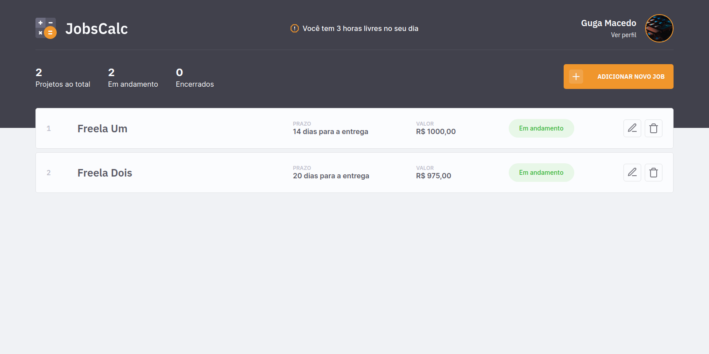

----
### Projeto e Tecnologias

O JobsCalc é uma aplicação de estimativa de cálculo para projetos freelancer, onde é possível cadastrar e excluir jobs (projetos), obtendo uma estimativa de custo de cada job. Além disso, é possível traçar o valor da hora da pessoa que estará usando o sistema. Para esse projeto, foi utilizado    

----
### Como rodar o projeto?
  - Após clonar o repositório, e estar com o NodeJS instalado (se não sabe como instalar tenho um tutorial [aqui](https://github.com/gugamacedo/my-notes)), rode os seguintes comandos:
  `npm i`
  `npm run init-db`
  `npm run dev`
